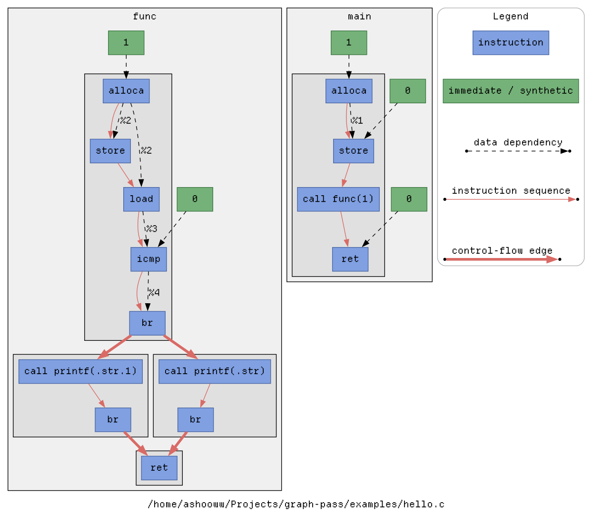
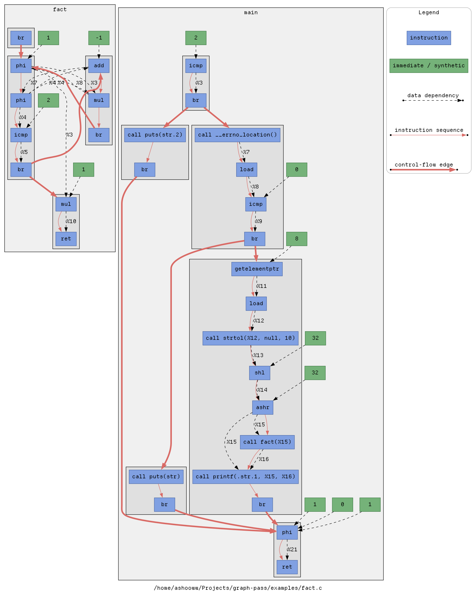
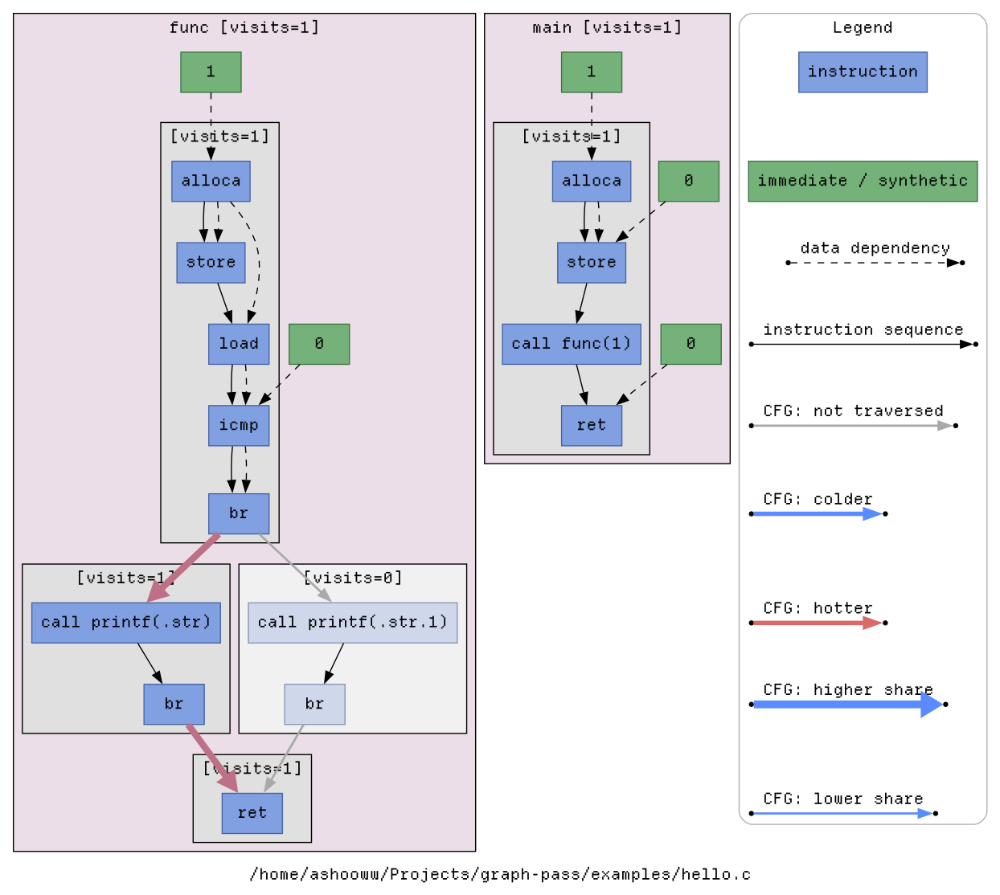
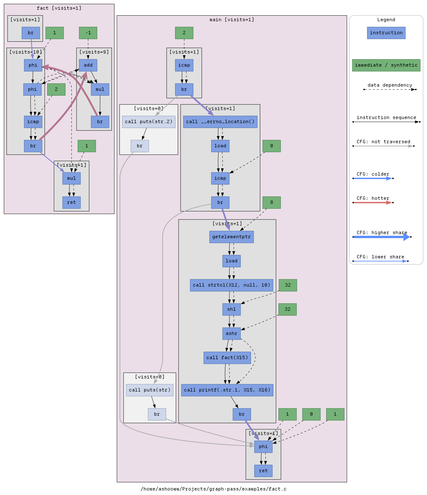

LLVM Pass for GraphViz control-data flow
----------------------------------------

### Requirements

GraphPass currently targets LLVM 22.

Required:
- LLVM 22 development headers and `llvm-config`
- Clang/Clang++ 22
- GNU Make
- Python 3

Optional:
- Graphviz (`dot`) for rendering generated graphs
- `xdot` for interactive graph viewing

### Build
```sh
make build
```

On distributions with version-suffixed binaries, you may override versions:
```sh
make build \
    CLANG=clang-22 \
    CLANGXX=clang++-22 \
    LLVM_CONFIG=llvm-config-22
```

### Trace


GraphPass emits a static control/data-flow graph while compiling the program,
instruments the resulting binary, records its execution, and produces a
runtime-enriched `dot` graph.

One-shot flow:

```sh
./graphpass trace --name fact --opt=-O1 examples/fact.c -- 10
dot -Tsvg out/fact/fact.runtime.dot -o out/fact/fact.runtime.svg
```

The equivalent split flow:

```sh
./graphpass compile --name fact --opt=-O1 examples/fact.c
./graphpass run out/fact -- 10
./graphpass enrich out/fact
dot -Tsvg out/fact/fact.runtime.dot  -o out/fact/fact.runtime.svg
```

`compile` and `trace` build the GraphPass plugin and runtime automatically
through the project Makefile when necessary.

### Graph kinds

This project produces two graph views:

- **Static graph** &mdash; emitted at compile time from LLVM IR. It shows the program structure only.
- **Runtime-enriched graph** &mdash; regenerated from the static manifest plus a runtime execution log. It preserves the same structure and overlays execution frequency and reachability.

### Runtime graph semantics

The runtime-enriched graph keeps the same structure as the static graph and adds execution information:

- **Functions**
  - Functions that were never reached are dimmed.
  - Reached functions show a visit count in the cluster label.
  - Function cluster color reflects how often the function was entered relative to other functions in the module.

- **Basic blocks**
  - Basic blocks that were never reached are dimmed.
  - Reached basic blocks show a visit count in the cluster label.

- **Intra-block edges and immediates**
  - Data edges, instruction ordering edges, and immediate-value nodes keep their static meaning and layout.
  - They are not used to encode runtime frequency.

- **Inter-block control-flow edges**
  - These edges encode runtime traversal.
  - **Thickness** reflects how often the edge was taken relative to other control-flow edges in the same function.
  - **Color** reflects how often the edge was taken relative to all recorded control-flow edges in the module:
    - gray: never taken
    - blue: colder / less frequent
    - red: hotter / more frequent

### Static graph examples

<table>
  <tr>
    <td align="center" style="vertical-align: top;">
      
    </td>
    <td align="center" style="vertical-align: top;">
      
    </td>
  </tr>
  <tr>
    <td align="center" valign="top">
      <code>./graphpass compile --name hello --opt=-O0 examples/hello.c</code>
    </td>
    <td align="center" valign="top">
      <code>./graphpass compile --name fact --opt=-O1 examples/fact.c</code>
    </td>
  </tr>
</table>

### Runtime graph examples

<table>
  <tr>
    <td align="center" style="vertical-align: top;">
      
    </td>
    <td align="center" style="vertical-align: top;">
      
    </td>
  </tr>
  <tr>
    <td align="center" valign="top">
      <code>./graphpass trace --name hello --opt=-O0 examples/hello.c</code>
    </td>
    <td align="center" valign="top">
      <code>./graphpass trace --name fact --opt=-O1 examples/fact.c -- 10</code>
    </td>
  </tr>
</table>
